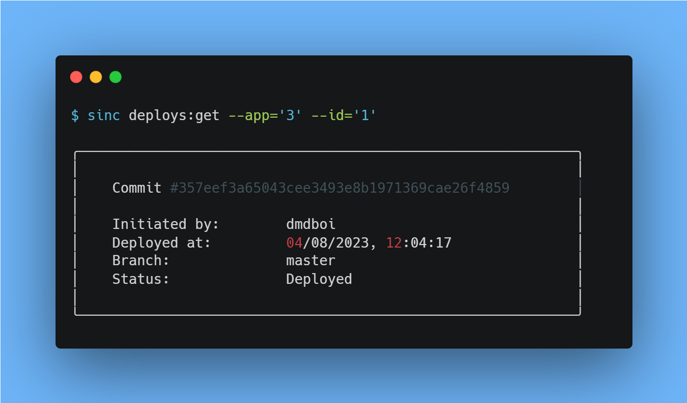

# cli

Interact with ServerSinc through the CLI



## Commands

#### Servers

```sh
sync servers:list

sync servers:get --id='id'
```

#### Applications

```sh
sync apps:list 

# optionally
sync apps:list --server='server_id'

sync apps:get --id='id'
```

#### Deploys

```sh
sync deploys:list --app='id'

sync deploys:get --app='app_id' --id='id'
```